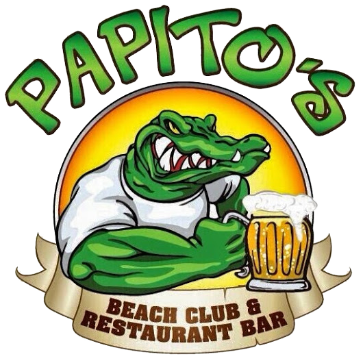
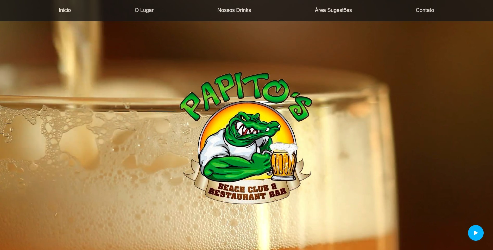
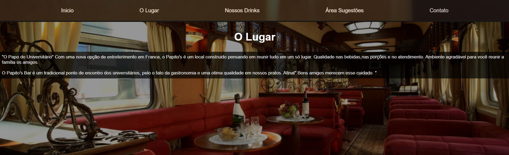
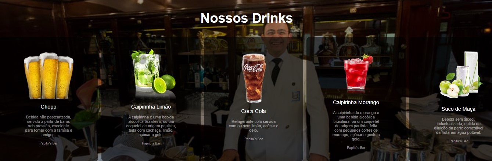
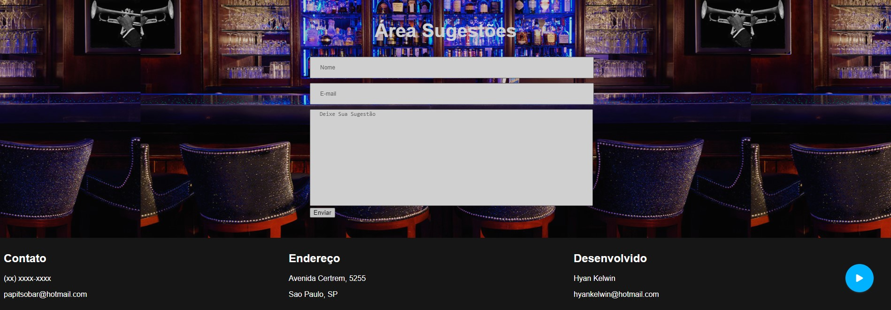

<h1 align="center">
<br>
  
<br>
<br>
</h1>

<p align="center">
  
  
  
  
</p>

## About

One of the first solutions in what I developed at the beginning of my career, papitos is a solution totally designed in a place where it could be a meeting point for university students, for the fact of gastronomy and a great quality in our dishes. The bar built on the site is a nice environment for you to gather family friends.

## Technologies

**- HTML5**
<br>
**- CSS3**
<br>
**- Javascript**
<br>

## Building

No installation or configuration is required to be able to use the papitos, just clone the project.

```bash
git clone https://github.com/hyankelwin/papitos-web.git
```

Ready just run the file **index.html** enjoy the interface :)
